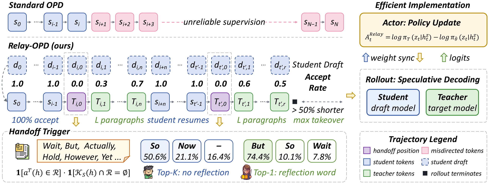

<div align="center">

#  Pass the Baton: Trajectory-Relayed On-Policy Distillation

[](https://arxiv.org/abs/2607.26057)
[](https://huggingface.co/papers/2607.26057)
[](https://zju-real.github.io/Relay-OPD/)
[](relay-opd/LICENSE)

<strong>Haolei Xu<sup>1,2&#42;</sup> · Xiaowen Xu<sup>2&#42;</sup> · Haiwen Hong<sup>2&#42;&dagger;</sup> · Zixuan Ni<sup>1</sup></strong><br>
<strong>Hongxing Li<sup>1,2</sup> · Yiwen Qiu<sup>1</sup> · Weiming Lu<sup>1&Dagger;</sup> · Yongliang Shen<sup>1</sup></strong>

<sup>1</sup>Zhejiang University &nbsp; <sup>2</sup>Yuvion Team, Alibaba Group

<sup>&#42;</sup>Equal contribution &nbsp; <sup>&dagger;</sup>Project leader &nbsp; <sup>&Dagger;</sup>Corresponding author

</div>

## 🔥 Overview

**Relay-OPD** fixes *prefix failure* in on-policy distillation. A label-free **handoff trigger** — the teacher's top-1 token is a reflection token while no reflection token appears in the student's top-K — locates failed prefixes online during student generation. The teacher then briefly takes over for a short **teacher leg** of L paragraphs, hands the trajectory back, and a limited **relay budget (M, L)** keeps intervention early and local. The entire rollout runs in a single speculative decoding engine (student as draft model, teacher as target model), and the student is optimized on the relayed trajectory, including the relay tokens themselves.

<div align="center">

</div>

<div align="center">

</div>

## 📢 News

- **`2026-07-29`**: 🔥🔥 We released our [paper](https://arxiv.org/abs/2607.26057) and the full training, ablation, and evaluation code.
- **`2026-07`**: 🔥 Project page released.

## 📖 Results

With a Qwen3-4B-Instruct-2507 teacher and Qwen3-0.6B/1.7B-Non-Thinking students on eight mathematical reasoning benchmarks, Relay-OPD achieves the best or second-best result on every benchmark — **+5.73%** over standard OPD and **+1.49%** over the strongest baseline FastOPD on average at 1.7B — while cutting average training trajectory length by **more than 50%**.

## 🛠️ Installation

The implementation lives in [`relay-opd/`](relay-opd/) and is built on [verl](https://github.com/verl-project/verl). The speculative-decoding patch targets vLLM internals, so **vLLM 0.21.0** is the one mandatory version pin.

### Python environment

```bash
git clone git@github.com:ZJU-REAL/Relay-OPD.git
cd Relay-OPD/relay-opd

conda create -n relay-opd python==3.12 -y
conda activate relay-opd

pip3 install -c environment/vllm-constraints.txt vllm==0.21.0
pip3 install -e .
pip3 install -r requirements-relay-opd.txt
```

Verify the installation (checks CUDA execution, the math grader, and every vLLM interface patched by Relay-OPD):

```bash
python environment/verify_install.py
```

For strict reproduction of our validated environment (Linux x86_64, Python 3.12, CUDA 13.0, PyTorch 2.11, vLLM 0.21.0), an optional locked installer is provided:

```bash
bash environment/create_locked_env.sh
```

### Training

Each script takes paths through environment variables. The main Relay-OPD run (paper defaults: K=5, M=2, L=3; eight GPUs split as four student + four teacher):

```bash
export STUDENT_MODEL=/path/to/student
export TEACHER_MODEL=/path/to/teacher
export TRAIN_DATA=/path/to/train.parquet
export BENCH=/path/to/eval_parquets
export OUTPUT_DIR=/path/to/output

bash opd/scripts/relay_opd/train.sh
```

Every baseline (SFT, SeqKD, GRPO, OPD, FastOPD, TRD, SKD) and every paper ablation has a dedicated script under `opd/scripts/`. See [`relay-opd/README.md`](relay-opd/README.md) for the full script index, offline data synthesis, and the complete paper configuration.

### Evaluation

```bash
RUN_NAME=relay_opd \
STEP=35 \
MODEL=/path/to/checkpoint/actor/huggingface \
DATA_DIR=/path/to/eval_parquets \
OUT_ROOT=/path/to/eval_output \
BENCHES=aime24,aime25,aime26,math500,amc23,olympiad,hmmt_feb_2026,hmmt_nov_2025 \
N_SAMPLES=32 MAX_NEW=32768 MAX_MODEL_LEN=34817 DP_SIZE=4 TP=1 \
bash opd/scripts/evaluation/math.sh
```

## ⭐️ Citation

If you find this project useful, welcome to cite us.

```bibtex
@misc{xu2026passbatontrajectoryrelayedonpolicy,
      title={Pass the Baton: Trajectory-Relayed On-Policy Distillation},
      author={Haolei Xu and Xiaowen Xu and Haiwen Hong and Zixuan Ni and Hongxing Li and Yiwen Qiu and Weiming Lu and Yongliang Shen},
      year={2026},
      eprint={2607.26057},
      archivePrefix={arXiv},
      primaryClass={cs.CL},
      url={https://arxiv.org/abs/2607.26057},
}
```

## 🤝 Acknowledgement

This project builds on [verl](https://github.com/verl-project/verl) and [vLLM](https://github.com/vllm-project/vllm). We thank the authors of those projects.
