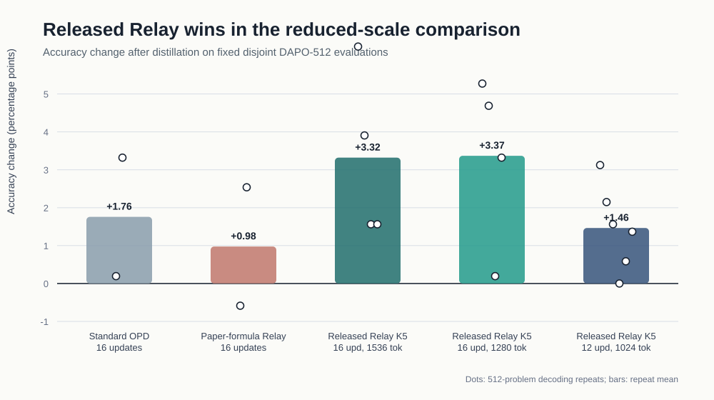
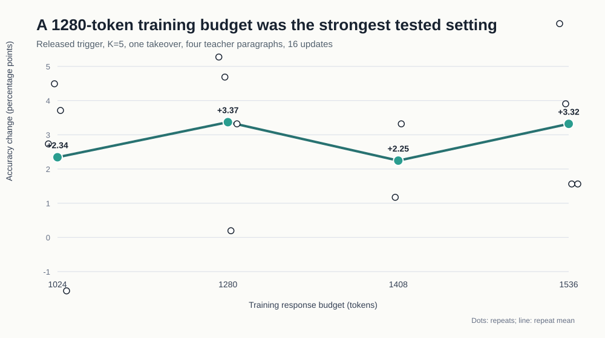
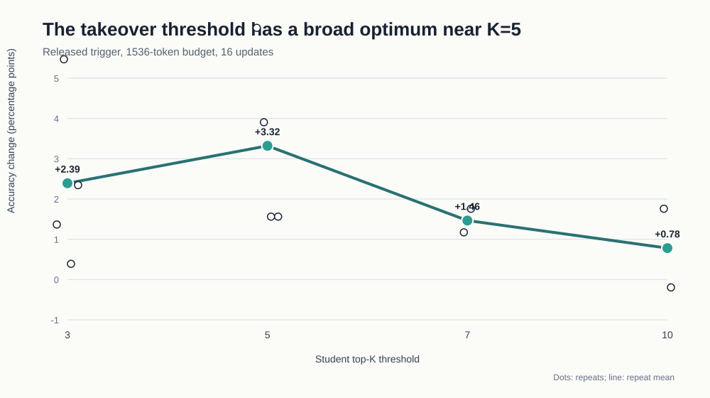
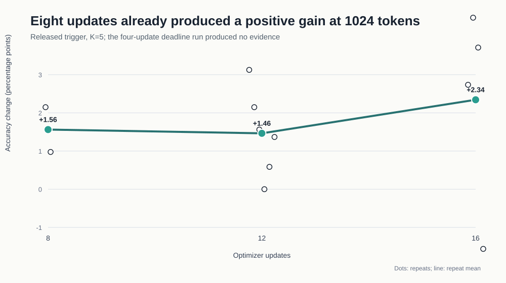
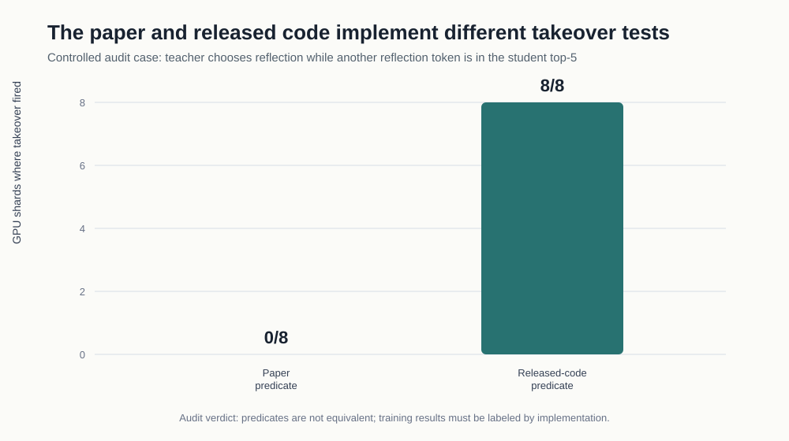

# Pass the Baton: a reduced-scale reproduction

Training a smaller language model from a stronger one is difficult when the smaller model must first generate useful practice answers. *Pass the Baton* proposes letting the stronger model briefly take over when the smaller model becomes uncertain, then training the smaller model on the resulting shared trajectories. This reproduction asks whether that handoff mechanism improves mathematical reasoning under a compact, controlled version of the released training setup.

## Verdict

**Partial reproduction supported.** The released-code version of Relay on-policy distillation produced a repeatable positive accuracy change and outperformed matched standard distillation and a literal implementation of the paper’s written trigger in the strongest reduced-scale comparisons. This does **not** reproduce the paper’s full-scale headline: training was deliberately compressed, evaluation used a fixed 512-problem slice, and the released takeover test is not mathematically equivalent to the formula in the paper.

Scope: the headline bars below summarize only Kubernetes runs with terminal measurement logs and `REPRO_RESULT status=PASS`.

**Figure 1. Primary result.** Each dot is the trained-minus-base change in correct answers on one 512-problem decoding repeat; bars average those dots and report percentage points. At 16 updates, the best released Relay settings gained about **3.3 points**, compared with **1.76** for standard distillation and **0.98** for the paper-formula variant. The spread of dots is important: these are small, noisy experiments, so the result supports a qualitative effect rather than a precise estimate of its size.

## What was tested

The student was Qwen3-1.7B and the teacher Qwen3-4B-Instruct-2507, using the official repository at commit `eab2145`. Relay generated training trajectories by allowing one teacher takeover of up to four paragraphs when the released top-\(K\) uncertainty test fired. Standard on-policy distillation and a formula-correct Relay implementation were matched controls.

Training used 2,048 DAPO-Math prompts. Evaluation used a disjoint tail slice of 512 prompts, a 2,048-token evaluation ceiling, and two fixed decoding seeds per checkpoint. Base and trained models were evaluated with the same protocol. The cluster used four GPUs for the student actor and four for the teacher in each job.

Across the complete experiment tree, the queue runner verified **77 successful Kubernetes runs with terminal logs**. Failed setup attempts and runs without terminal measurement evidence—including the deadline-truncated four-update boundary test—were excluded from scientific claims.

## Robustness across response budget

**Figure 2. Response budget.** With the released trigger fixed at \(K=5\) and 16 updates, 1,280 training-response tokens gave the largest mean gain: **17.25 additional correct answers per 512**, or **3.37 points**. The 1,536-token setting was essentially tied at **3.32 points**. The shorter 1,024-token setting remained positive on average but included one negative repeat, showing why multiple training runs and decoding repeats matter.

This suggests that simply allowing longer trajectories is not the main explanation. A moderate budget preserved the benefit while avoiding the longest tested responses.

## Robustness to the takeover threshold

**Figure 3. Top-\(K\) threshold.** Smaller \(K\) makes teacher takeover easier; larger \(K\) requires stronger disagreement. \(K=5\) was the strongest tested setting, averaging **3.32 points** at the 1,536-token budget. \(K=3\) remained positive but weaker, while \(K=7\) and \(K=10\) declined. The broad peak near five is consistent with a balance: intervene often enough to repair weak trajectories, but not so often that the teacher dominates them.

## How early does the benefit appear?

**Figure 4. Update horizon at 1,024 tokens.** Eight optimizer updates already produced **+11 and +5** correct answers, averaging **+1.56 points**. Three independent 12-update training seeds yielded six nonnegative repeat deltas—`[16, 11, 8, 0, 3, 7]`—for a mean of **+1.46 points**. The 16-update mean was higher (**+2.34 points**) but less stable because one repeat was negative. The four-update boundary run reached only its first update before the compute deadline and provides no measurement.

The useful conclusion is therefore bounded: the effect appears by eight updates in this setup, but the minimum sufficient horizon is unresolved.

## A critical implementation diagnostic

**Figure 5. Trigger mismatch.** The paper’s formula asks whether any reflection-like token is present in the student’s top-\(K\) set. The released code instead asks whether the teacher’s single highest-probability token is absent from that set. In a controlled case where those predicates disagree, the paper predicate fired on **0/8** GPU shards and the released predicate on **8/8**. Separate invariant tests confirmed the sampler, suppression rule, teacher leg, and takeover budget on all eight shards.

This distinction changes the interpretation of the result. The strongest evidence reproduces the behavior of the **released implementation**, not a literal end-to-end reproduction of the written algorithm. The formula-correct control was positive on average but smaller and noisier: `[-3, +13]` correct, or **+0.98 points**.

## Limitations and interpretation

- The experiment is much smaller than the paper’s full training regime. Its result is a direction-of-effect check, not a replacement for the reported benchmark suite.
- All headline evaluations reuse one fixed 512-problem slice. Decoding repeats measure sampling variation; only selected conditions also use independent training seeds.
- Accuracy gains came with longer generated answers and more truncation. For example, the three-seed 12-update/1,024-token condition added roughly 234 generated tokens on average. Eight updates added about 148, suggesting a better efficiency trade-off despite similar mean accuracy gain.
- Repeat counts differ across conditions, and no formal hypothesis test was preregistered. The point estimates should not be ranked more finely than the data support.

Overall, the evidence supports the paper’s central qualitative intuition: selective teacher handoffs can create training trajectories that improve a smaller model. The most defensible reproduced recipe here is the released trigger with \(K=5\), one four-paragraph takeover, and a 1,280-token response budget for 16 updates; a cheaper 1,024-token, eight-update variant also retained a clear positive signal.

Supporting values and calculations are in `plotted_measurements.csv` and `analysis.ipynb`.
